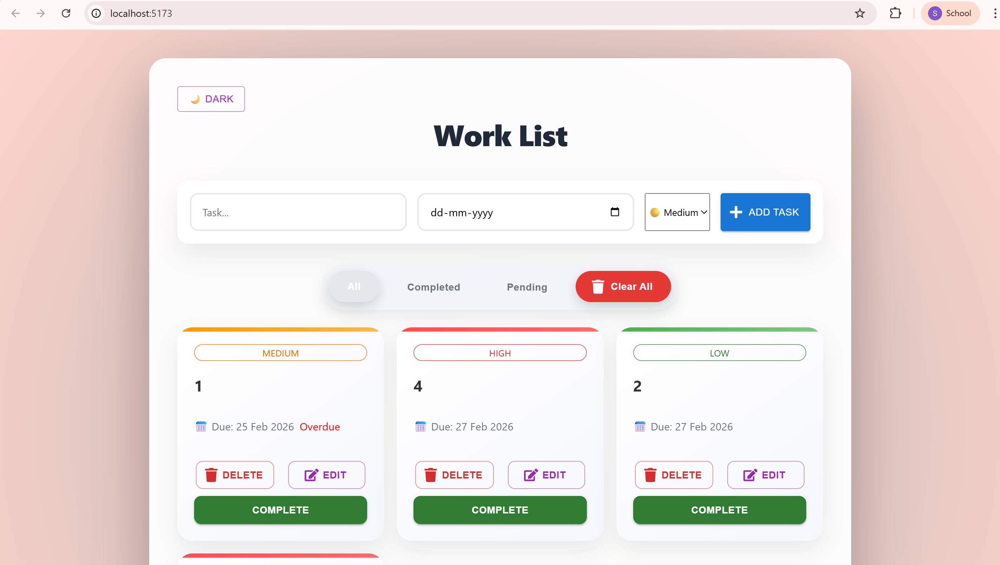
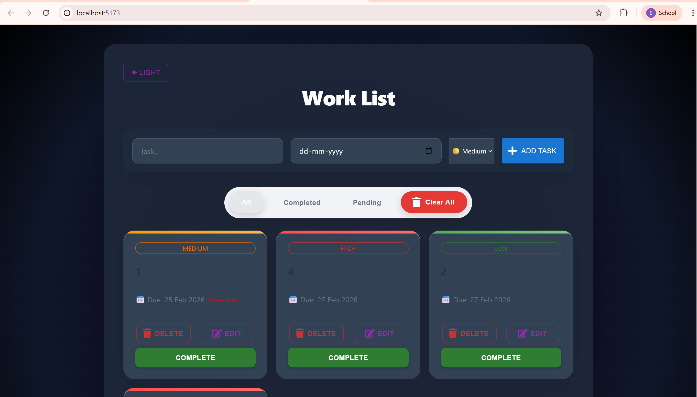

# Todo Management System

A full-stack Todo Management System built using React, Spring Boot, and PostgreSQL (Neon DB).  
This project demonstrates full-stack development, REST API design, cloud database integration, and a polished modern UI.

---
## 📌 Project Overview

This application allows to manage tasks with priority levels, due dates, filtering, and status tracking. It follows a clean frontend-backend separation using REST APIs.

The goal of this project was to:
 • Build a complete CRUD system
 • Connect React frontend with Spring Boot backend
 • Use a cloud-hosted PostgreSQL database
 • Design a modern UI using Material UI
 • Implement real-world UX improvements

---
### 🧠 Architecture

**Frontend (React)**  
⬇ Axios HTTP requests  
**Backend (Spring Boot REST API)**  
⬇ Spring Data JPA  
**Database (PostgreSQL on Neon Cloud)**  

### Layered Design
- **Controller Layer** → Handles API endpoints  
- **Service Layer** → Business logic  
- **Repository Layer** → Database interaction  
- **Database Layer** → PostgreSQL  
---


## ✨ Features
- Add, edit, delete tasks  
- Mark tasks as completed or pending  
- Due date support with overdue indicator  
- Task priority (High / Medium / Low)  
- Filter tasks (All / Completed / Pending)  
- Clear all tasks (with smart empty-state message)  
- Responsive modern design with dark mode  

## 📅 Productivity Enhancements
- Overdue task indicator  
- Priority tagging with color codes  
- Quick filters (All / Completed / Pending)  
- Undo option for completed tasks  

## 🎨 Modern UI

• Material UI components
• Custom gradient cards
• Priority color strip on each card
• Segmented filter bar
• Toast notifications
• Responsive layout
• Hover animations
• Dark mode toggle


---

## 🧱 Project Structure

- /frontend   -> React (Vite) client

- /backend    -> Spring Boot app

- /database   -> SQL scripts -->

---

## 🛠 Tech Stack

### Frontend
- React (Vite)
- Axios
- CSS
- Material UI
- React Toastify
- React Icons
- DayJS

### Backend
- Spring Boot
- Maven
- Spring Data JPA
- Lombok
- web
- Devtools
- REST APIs

### Database
- PostgreSQL (Neon Cloud DB)

---


## 🛠 Database Setup (PostgreSQL with Neon DB)

1. Sign up at [Neon](https://neon.tech) and create a new project.  
2. Copy the provided connection string.  
3. Configure environment variables in `application.properties`.  
4. Run SQL migration scripts to create tables.  


```application.properties
spring.datasource.url=jdbc:postgresql://<host>/<database>?sslmode=require
spring.datasource.username=<user>
spring.datasource.password=<password>
spring.datasource.driver-class-name=org.postgresql.Driver
spring.jpa.hibernate.ddl-auto=update
```
⚠️ Keep sensitive values (username/password) out of version control. Use environment variables or a secrets manager in production.

---

## ⚙️ Environment Setup

  ### 1️⃣ Clone Repository
  ```
  git clone <repo-url>
  cd project-folder 
  ```
---
  ### 2️⃣ Backend Configuration

Add database configuration in:

``` backend/src/main/resources/application.properties ```

```application.properties
spring.datasource.url=jdbc:postgresql://<host>/<database>?sslmode=require
spring.datasource.username=<user>
spring.datasource.password=<password>
spring.datasource.driver-class-name=org.postgresql.Driver
spring.jpa.hibernate.ddl-auto=update
```
---
  ### 3️⃣ Database Table
```sql
CREATE TABLE todos (
    id BIGSERIAL PRIMARY KEY,
    workname VARCHAR(255) NOT NULL,
    work BOOLEAN NOT NULL DEFAULT FALSE,
    work_date DATE,
    priority VARCHAR(20) NOT NULL DEFAULT 'MEDIUM',
    CONSTRAINT priority_check
        CHECK (priority IN ('HIGH','MEDIUM','LOW'))
);
```
---

  ### ▶️ Run Backend (Spring Boot)

Navigate to backend folder: 
```
 cd myapp
 mvn spring-boot:run
```
 Backend runs at: http://localhost:8080/todos


 ## ▶️ Run Frontend (React)

Navigate to frontend folder:
```
cd frontend
npm install
npm run dev
```

Frontend runs at: http://localhost:5173

---


## 🔌 API Endpoints

| Method | Endpoint       | Description        |
|--------|----------------|--------------------|
| GET    | /todos         | Get all tasks      |
| POST   | /todos/save    | Create a new task  |
| PUT    | /todos/{id}    | Update a task      |
| DELETE | /todos/{id}    | Delete a task      |
| DELETE | /todos/clear   | Delete all tasks   |

---


## 🎯 What This Project Demonstrates

- Full-stack architecture
- REST API design
- Cloud database integration
- Modern React UI patterns
- Production-style project structure

---

## 🛡 Error Handling
- Toast notifications for API failures  
- Validation prevents empty task submission  
- Safe checks before clearing tasks  
- Graceful UI updates after API calls 

---

## 📸 Screenshots
### Dashboard View


### Dark Mode


---